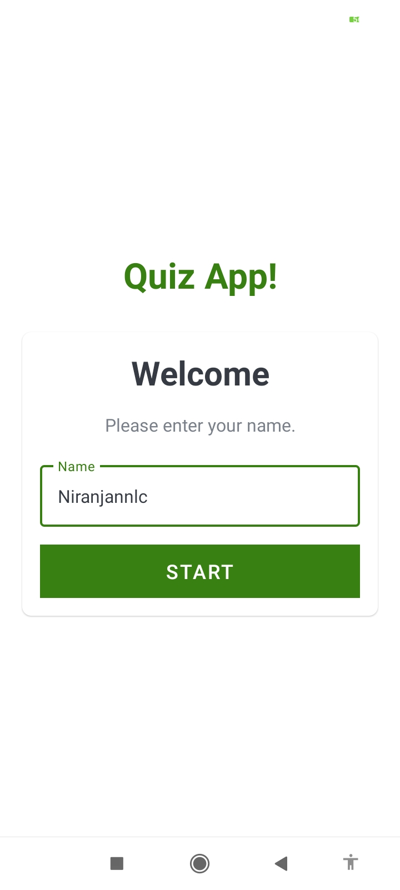
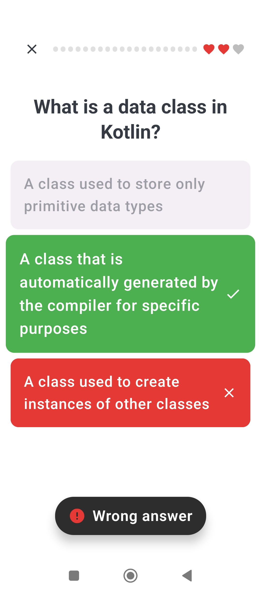
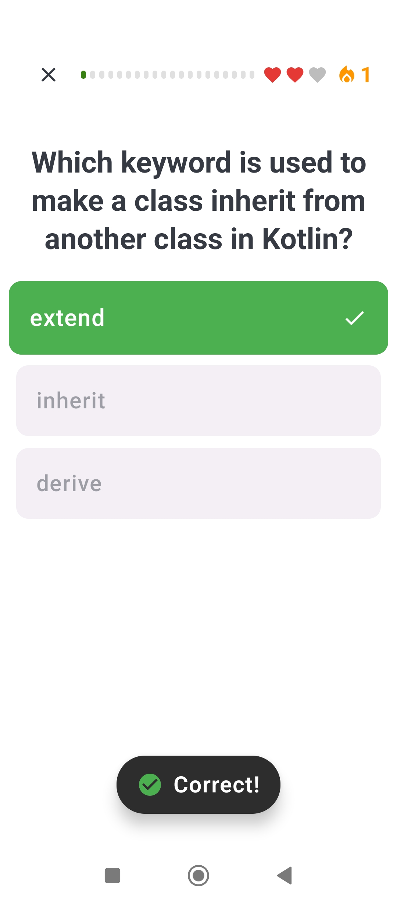
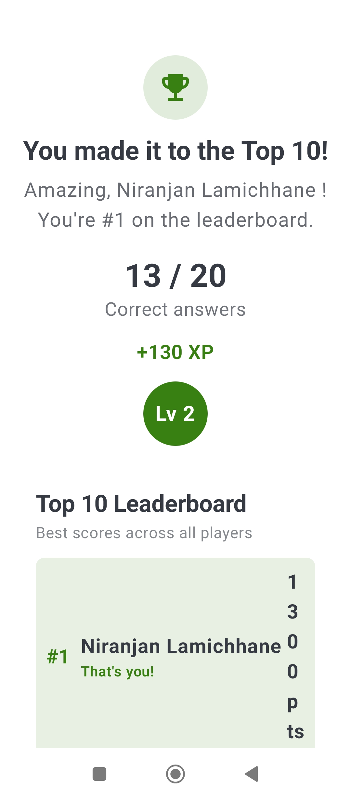

# Kotlin Quiz App

Kotlin Quiz is an Android app for testing your Kotlin programming knowledge through interactive multiple-choice quizzes. The experience is built around gamification — streaks, lives, XP, levels, and a local leaderboard — with a modern Jetpack Compose UI for the quiz and results flows.

The project follows clean architecture and MVVM across three Gradle modules:

| Module | Role |
|--------|------|
| **app** | Presentation layer — Fragments, ViewModels, and Compose screens |
| **domain** | Business logic — use cases, entities, and repository contracts |
| **data** | Data layer — Room database, DAOs, and repository implementations |

[](https://f-droid.org/packages/com.example.kotlinquiz/)

## Screenshots

<p align="center" padding="40">
    
    
    
    
</p>

## Features

### Gamification

- **Lives system** — Start each quiz with 3 hearts; wrong answers cost a life.
- **Answer streaks** — Consecutive correct answers build a streak shown with a flame counter in the top bar.
- **Instant feedback** — Animated toasts confirm correct or incorrect answers before moving on.
- **XP & levels** — Earn 10 XP per correct answer; level-up badges animate in when you hit milestones.
- **Local leaderboard** — Top 10 scores are tracked in Room and highlighted on the results screen.
- **Animated results** — Score counts up with spring animations; leaderboard entries show rank and points.

### Quiz experience

- Randomized Kotlin questions loaded from bundled JSON assets.
- Segmented progress bar tracks your position through the quiz.
- Animated answer cards with color feedback, shake effects, and input locking between questions.
- Play Again and Back to Home actions after each round.

### Architecture & quality

- **MVVM** with ViewModels exposing `StateFlow` / `LiveData` to the UI.
- **Use cases** in the domain layer (`CreateQuizUseCase`, `QuestionAnswerUseCase`, `SubmitQuizResultUseCase`).
- **Dagger Hilt** for dependency injection across all modules.
- **Room** for offline quiz, score, and leaderboard persistence.
- **Unit & integration tests** for domain use cases and data repositories.

## UI stack

The quiz and results screens are built with **Jetpack Compose** and **Material 3**, hosted inside Fragments via `ComposeView`. A custom `QuizTheme` provides app-wide colors and typography. The welcome screen still uses the traditional View/XML layout with Navigation Component for screen transitions.

Compose screens live under `app/src/main/java/com/example/kotlinquiz/ui/compose/`:

- `quiz/` — `QuizScreen`, `QuizTopBar`, `AnswerCard`, `FeedbackToast`
- `result/` — `ResultScreen` with leaderboard, XP display, and level badge
- `theme/` — `QuizTheme` and color palette

## Getting started

### Prerequisites

- Android Studio (latest stable recommended)
- JDK 21
- Android SDK 37 (compile SDK)

### Setup

1. Clone the repository:
   ```bash
   git clone https://github.com/NiranjanNlc/Kotilin-Quiz.git
   ```
2. Open the project in Android Studio.
3. Sync Gradle and run on an emulator or physical device (min SDK 24).

## Tech stack

| Category | Libraries |
|----------|-----------|
| Language | Kotlin 2.3.21 |
| Build | Android Gradle Plugin 9.2.0, KSP 2.3.7 |
| UI | Jetpack Compose (BOM 2024.12.01), Material 3, Activity Compose |
| Architecture | ViewModel, LiveData, StateFlow, Navigation Component |
| DI | Dagger Hilt 2.59.2 |
| Database | Room 2.8.4 |
| Testing | JUnit, Mockito Kotlin, MockK, Espresso, Hilt Android Testing |

## Project structure

```
Kotilin-Quiz/
├── app/          # Presentation — Activities, Fragments, Compose UI, ViewModels
├── domain/       # Use cases, entities, repository interfaces
├── data/         # Room DB, DAOs, repository implementations, question assets
└── fastlane/     # Play Store metadata and screenshots
```

## Contributing

Contributions are welcome. If you find a bug or have an idea for improvement, open an issue or submit a pull request.

## License

This project is licensed under the MIT License.

---

Happy quizzing!
